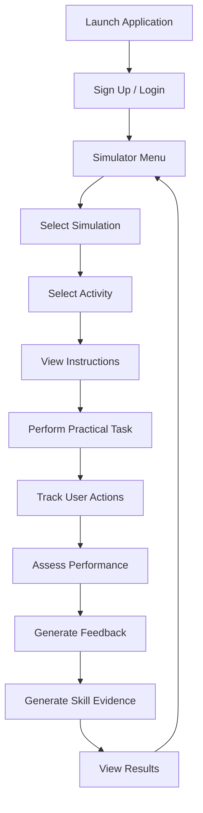
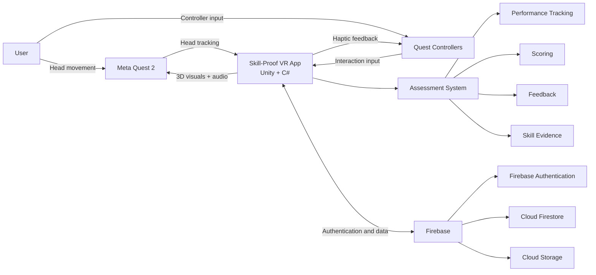

# Skill-Proof

> An immersive VR platform for demonstrating and assessing practical skills and providing performance evidence.

## Description

**Skill-Proof** is a VR capstone project that allows users to perform selected practical skills in an immersive virtual environment and have their performance assessed.

**Problem:** People may have practical skills gained through education, vocational training, informal learning, apprenticeship, or work experience but may have limited practical evidence to demonstrate what they can do. This can make it difficult for employers to understand a person's demonstrated practical ability.

**Solution:** Skill-Proof provides predefined practical VR activities where users perform tasks while the system tracks their actions, assesses their performance, and generates skill evidence that can help communicate demonstrated competency to employers and other stakeholders.

### Key features

* Predefined practical VR activities for electrical wiring and solar panel installation.
* Interactive 3D environments with virtual tools and equipment.
* Performance tracking and assessment.
* Real-time or activity-based feedback and scoring.
* Tracking of accuracy, errors, safety compliance, and completion time.
* Performance results and digital skill evidence.
* User accounts and authentication using Firebase.

## Links

| Resource          | Link                                                                                                                                                    |
| ----------------- | ------------------------------------------------------------------------------------------------------------------------------------------------------- |
| GitHub repository | [Skill-Proof GitHub](https://github.com/Wakhi-Ken/Skill-Proof-An-Immersive-Simulation-Platform-for-Demonstrating-Assessing-Practical-Skills-Competency) |
| Figma designs     | [Skill-Proof on Figma](https://www.figma.com/design/C4MHMWXMz2jBHC4t71BWcv/Skill-Proof?node-id=0-1&p=f&t=zkOPKaTbnOLc6Ktw-0)                            |
| Demo video        | `<[Add demo video link](https://youtu.be/gIodQVoGv6o)>`                                                                                                                                 |

## Setup: Environment and Project

### Prerequisites

| Requirement          | Version / Notes          |
| -------------------- | ------------------------ |
| Game engine          | Unity 6                  |
| Programming language | C#                       |
| XR SDK               | XR Interaction Toolkit   |
| VR headset           | Meta Quest 2             |
| Input                | Quest Touch controllers  |
| OS                   | Windows                  |
| Version control      | Git / GitHub             |
| Backend              | Firebase                 |
| Development tools    | Unity Hub, Visual Studio |

### Installation

```bash
# 1. Clone the repository

git clone https://github.com/Wakhi-Ken/Skill-Proof-An-Immersive-Simulation-Platform-for-Demonstrating-Assessing-Practical-Skills-Competency.git

# 2. Enter the project folder

cd Skill-Proof-An-Immersive-Simulation-Platform-for-Demonstrating-Assessing-Practical-Skills-Competency
```

Open the project using **Unity Hub** and select the Unity 6 version used to develop the project.

### Configure the project

1. Open the project in Unity.
2. Open **Edit → Project Settings → XR Plug-in Management**.
3. Configure the Android/VR platform for Meta Quest 2.
4. Open **Window → Package Manager** and ensure the required XR packages are installed.
5. Configure Firebase Authentication and other Firebase services used by the project.
6. Open the **Start Menu** scene.

### Run the project

**In the Unity Editor:**

Press **Play** to test the application.

**On Meta Quest 2:**

1. Enable Developer Mode on the headset.
2. Connect the headset to the development computer.
3. Select **File → Build Profiles** and configure an Android build.
4. Build and install the application on the Meta Quest 2.

## 🎨 Designs

### Figma mockups and prototype

Full prototype:

[Open Skill-Proof in Figma](https://www.figma.com/design/C4MHMWXMz2jBHC4t71BWcv/Skill-Proof?node-id=0-1&p=f&t=zkOPKaTbnOLc6Ktw-0)

The Figma prototype covers the main user interface, application flow, simulation selection, practical activities, performance results, and skill evidence.

| Screen                | Preview                                          |
| --------------------- | ------------------------------------------------ |
| Start Menu            | ``     |
| Login                 | ``               |
| Simulator Menu        | ``       |
| Activity Instructions | `` |
| Results               | ``           |
| Skill Evidence        | ``         |

### Interaction Flow



### System / Hardware Diagram

Because Skill-Proof is a VR software application, a **system/hardware block diagram** is used instead of a traditional electrical circuit diagram.



### App Screenshots

| Screenshot                                         | Description                   |
| --------------------------------------------------- | ------------------------------ |
| ``      | Login interface               |
| ``  | Simulator selection interface |
| `` | VR practical simulation       |
| ``    | Performance results           |
| ``   | Skill evidence                |

##  Assets

| Asset                       | Type      | Purpose / Justification                              | Source            |
| --------------------------- | --------- | ---------------------------------------------------- | ----------------- |
| Virtual tools and equipment | 3D models | Used to create the practical simulation environments | Own / Free assets |
| Electrical components       | 3D models | Used for the electrical wiring simulation            | Own / Free assets |
| Solar panel components      | 3D models | Used for the solar installation simulation           | Own / Free assets |
| UI icons                    | 2D        | Used for menus and interface elements                | Own / Free assets |


##  Hardware Integration

* **Device:** Meta Quest 2
* **Input:** Quest Touch controllers
* **Development platform:** Unity 6 + XR Interaction Toolkit
* **Programming:** C#

| User action        | Hardware input          | Result in the experience           |
| ------------------ | ------------------------ | ----------------------------------- |
| Select an object   | Controller trigger      | Object is selected/interacted with |
| Grab an object     | Controller trigger/grip | Virtual object can be manipulated  |
| Move around        | Controller thumbstick   | User moves through the environment |
| Look around        | Head movement            | User views the virtual environment |
| Complete an action | Controller interaction  | System records the action          |
| Pause              | UI button                | Simulation is paused               |

##  Deployment Plan

1. **Build:** Create an Android build of the Unity application for Meta Quest 2.
2. **Testing:** Install the application on the headset and test the two practical simulations.
3. **User Evaluation:** Test the prototype with a selected sample of users.
4. **Backend:** Use Firebase Authentication, Cloud Firestore, and Cloud Storage for the required online services.
5. **Distribution:** Initially distribute the application through direct APK installation/sideloading for testing.
6. **Future Deployment:** A future version could be distributed through an appropriate Meta Quest application distribution platform.
7. **Maintenance:** Continue fixing bugs and improving the application based on testing and user feedback.

##  Project Structure

```text
Skill-Proof/
│
├── Assets/
│   ├── Scenes/
│   ├── Scripts/
│   ├── Prefabs/
│   ├── Models/
│   └── Materials/
│
├── docs/
│   ├── designs/
│   └── screenshots/
│
├── builds/
│
└── README.md
```

## Project Scope

The current prototype contains two predefined practical simulations workflow for users:

1. **Electrical Wiring Installation**
2. **Solar Panel Installation**

The project does not currently include:

* full intergrated system logic to test competency and more
* record video feature
* working genaration evidence system
* Official professional certification

##  Developer

| Name            | Role                                     |
| --------------- | ----------------------------------------- |
| Wakhile Dlamini | Software Engineering Student / Developer |


